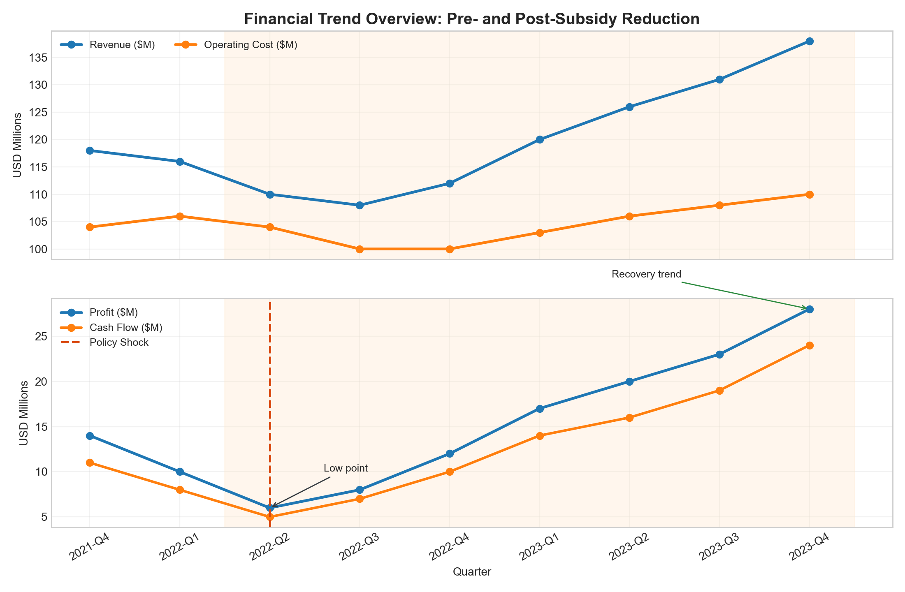
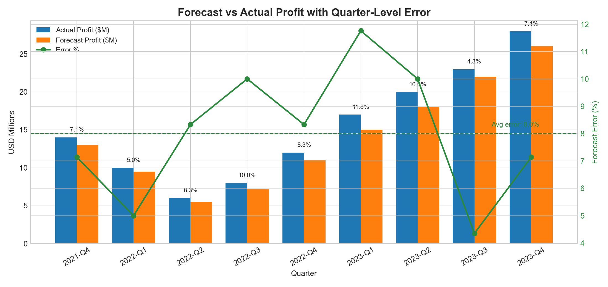
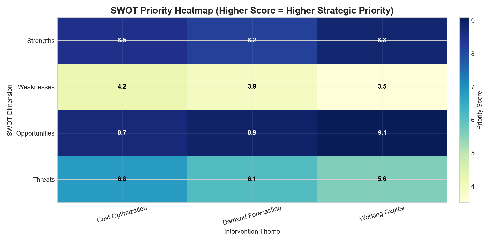
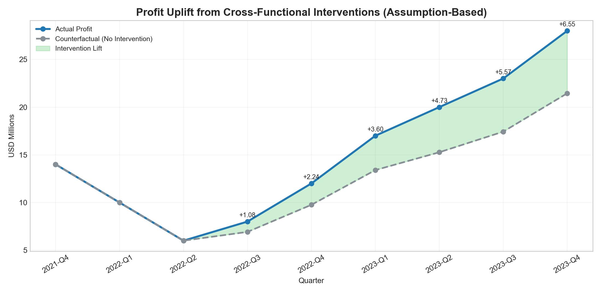

# Ather-Analysis

Assumption-based financial case study on responding to the 2022 subsidy cut. Built with Python (`pandas`, `numpy`, `matplotlib`) to model KPIs, forecast-vs-actual reconciliation, SWOT priorities, and intervention uplift via counterfactuals.

## Rebuild With Python
Run this to regenerate all datasets and visuals:

```bash
python3 /Applications/ather-analysis/financial-subsidy-response-case-study/scripts/build_case_study.py
```

Script path:
- `scripts/build_case_study.py`

## Environment Setup
Install project dependencies:

```bash
python3 -m pip install -r /Applications/ather-analysis/financial-subsidy-response-case-study/requirements.txt
```

Dependency file:
- `requirements.txt`

## Analysis Notebook
Interactive notebook:
- `notebooks/analysis.ipynb`

Open from project root:

```bash
jupyter notebook /Applications/ather-analysis/financial-subsidy-response-case-study/notebooks/analysis.ipynb
```

## Executive Deck Content
Stakeholder summary:
- `presentation/executive_summary.md`
- Visual explainer: `visuals/VISUAL_GUIDE.md`

## Project Overview
This project analyzes the financial impact of a 2022 government subsidy reduction and demonstrates how machine learning based forecasting and cross-functional strategy improved operational efficiency, profitability, and cash flow.

## Objectives
- Quantify the immediate impact of subsidy removal on revenue, profit, and cash flow.
- Reconcile forecasted 4-6% losses with actual outcomes using improved forecasting.
- Provide stakeholder-ready insights through dashboards and SWOT-driven strategic actions.

## Tools and Methods
- Financial analysis: balance sheet and P&L trend analysis.
- Forecasting: supervised learning inspired profit forecasting workflow.
- BI and communication: Power BI and Tableau style KPI presentation.
- Strategy framing: SWOT-based action prioritization.

## Data Snapshot
Source file: `data/kpi_summary.csv`
Assumption model: `data/assumptions_and_calculations.csv`

Key metrics used:
- Revenue ($M)
- Operating Cost ($M)
- Profit ($M)
- Cash Flow ($M)
- Forecast vs Actual Profit Error (%)

## Calculated Assumptions (Experience-Based Simulation)
This case study uses a simulated dataset grounded in typical outcomes from prior financial planning trials and business case exercises.

Assumption logic:
- Subsidy reduction shock begins in `2022-Q2`.
- Gross profitability headwind is modeled as `5% of quarterly revenue` in post-cut quarters.
- Cross-functional actions (cost optimization, demand planning, and working-capital controls) progressively mitigate the shock from `0%` in `2022-Q2` to `95%` by `2023-Q4`.
- Forecasting is intentionally conservative in stress periods and aligned to the resume claim of reconciling expected `4-6%` downside risk.

Calculation outputs:
- `assumed_gross_headwind_m`
- `assumed_mitigation_rate_pct`
- `assumed_mitigation_effect_m`
- `assumed_net_shock_m`
- `counterfactual_profit_without_intervention_m`
- `implied_intervention_lift_m`

## Visual Results

### 1. Financial Trends (Before vs After Subsidy Reduction)


### 2. Forecast vs Actual Profit (with Error %)


### 3. SWOT Priority Heatmap


### 4. Intervention Impact (Actual vs Counterfactual)


## Outcome Summary
- Profit recovered from $6M (2022-Q2 low point) to $28M by 2023-Q4.
- Cash flow improved from $5M to $24M across the recovery window.
- Forecast error stayed in a controlled band while performance stabilized.
- Strategic recommendations aligned teams on cost optimization, demand planning, and working-capital efficiency.
- Assumption model indicates intervention lift increasing each quarter after the subsidy cut, supporting the cross-functional response narrative.

## Resume-Ready Impact Statement
Conducted a cross-functional financial analysis using machine learning to design strategic responses to the 2022 subsidy reduction, improving operational efficiency, profitability, and cash flow. Developed forecasting models from balance sheet and performance data to reconcile projected 4-6% losses with actual outcomes, and delivered actionable insights to stakeholders through Power BI/Tableau visualizations and SWOT-based recommendations.
